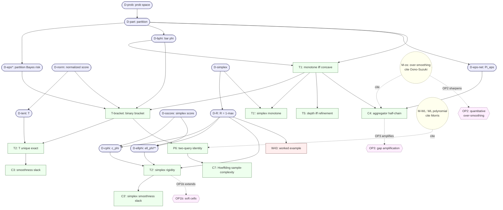
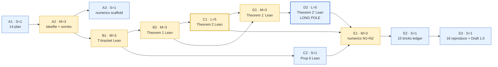

# Harness and Reproduction DAG

*Plan for the verification harness that hardens Draft 0.5+ of `03-t0-achievable_error_floor.md`. Two intertwined components: (i) a **Lean 4 + mathlib mechanization kernel** that mechanically verifies the load-bearing theorems against type-checked hypotheses, and (ii) a **brick-by-brick reproduction DAG** that any future reader can replay end-to-end from the workspace, mapping every claim in the manuscript to its proof object, its commit, its mechanization status, and its computational verification (if any).*

> **Scope.** Replaces and supersedes the high-level direction in [`09-mechanization_strategy.md`](09-mechanization_strategy.md) with an executable plan. `09` set the *strategy* (kernel-only, Lean 4, post-0.4 sequencing); this document is the *execution plan* with named nodes, dependency edges, scaffolding commits, and acceptance criteria.

---

## 1. Goals and non-goals

**Goals.**
1. Every numbered statement in `03` (Theorem 1, Theorem 1′, Theorem 2, Theorem 2′, Theorem 5, Corollary 3, Corollary 3′, Corollary 4, Proposition 6, Corollary 7) has a **traceable provenance** through: (a) the manuscript paragraph, (b) the closure-defining commit(s), (c) the Lean target (if mechanized), and (d) the computational verification artifact (worked-example check, where applicable).
2. The **load-bearing rigidity kernel** (Theorem 1, Theorem 2, Theorem 2′, Proposition 6 — ≈750 LoC per `09`) is mechanically verified in Lean 4 + mathlib against type-checked hypotheses.
3. The harness is **reproducible**: any future contributor can run a single command and re-verify the kernel, recompute the worked examples, and regenerate the brick-DAG diagram.
4. The DAG itself is **revisable**: when a manuscript edit changes a theorem statement, the change propagates to (i) the Lean target's hypothesis list, (ii) the DAG node, (iii) the brick's status in the post-mortem table.

**Non-goals.**
1. Mechanizing §6 (architecture sorting — modeling claim, not theorem).
2. Mechanizing §7 (algorithmic complexity — requires a model of computation).
3. Mechanizing Theorem 5 (counterexample-based; optional in `09` and we keep it optional here).
4. Empirical companion paper (Corollary 4 ladder benchmarks, over-smoothing onset curves, local-test field data). Separate workstream.

---

## 2. Repository layout after harness lands

```
rigidity/
├── 01-…                       (reference: existing background notes)
├── 02-…
├── 03-t0-achievable_error_floor.md   (Draft 0.5+ — the paper)
├── 04-…                       (redirect to 03 §4)
├── 05-…                       (PI audit of Draft 0)
├── 06-…                       (commitology 0 → 0.1)
├── 07-…                       (audit of 04)
├── 08-…                       (commitology 0.1 → 0.2)
├── 09-mechanization_strategy.md
├── 10-…                       (audit of Draft 0.2)
├── 11-…                       (commitology 0.2 → 0.3)
├── 12-…                       (audit of Draft 0.3)
├── 13-…                       (commitology 0.3 → 0.4)
├── 14-harness_and_reproduction.md     (THIS FILE)
├── 15-bricks.md               (brick-by-brick provenance ledger; auto-cross-referenced)
├── 16-reproduce.md            (one-page "how to re-verify everything")
├── lean/
│   ├── lakefile.lean          (Lean 4 + mathlib build)
│   ├── lean-toolchain         (pinned toolchain)
│   ├── lake-manifest.json     (pinned mathlib commit)
│   ├── Rigidity.lean          (top-level: re-exports all kernel theorems)
│   └── Rigidity/
│       ├── Bracket.lean       (the bracket display + universal c_phi = 1/2 proof)
│       ├── Theorem1.lean      (refinement-monotone <=> concave)
│       ├── Theorem2.lean      (binary rigidity: T is unique exact score)
│       ├── Theorem2Prime.lean (simplex rigidity: lambda*R is the only exact)
│       ├── Proposition6.lean  (two-query identity + variance bracket)
│       └── WorkedExample.lean (numerical verification of section 4.3 example)
└── verify/
    ├── numerics.py            (re-run section 4.3 worked example; check Cor 4 chain on small graphs)
    ├── run-all.ps1            (one-command harness: lake build + python numerics + DAG regen)
    └── README.md              (what each command does)
```

Total new files when harness ships: 3 markdown + 1 `lakefile` + 7 Lean modules + 3 verify scripts = **14 files**.

---

## 3. The brick-by-brick reproduction DAG

Each *brick* is a single claim in the manuscript with a fixed identity, traceable through prose / commit / Lean / numerics.

### Brick taxonomy

| Brick class | Symbol | What it is | Mechanizable? |
|---|---|---|---|
| **Definition** | D | A named object the rest of the paper uses ($\Pi$, $\bar\varphi$, $\varepsilon^\ast$, normalized score, $\Pi_\varepsilon$, …) | yes — Lean structures / defs |
| **Theorem** | T | A numbered theorem or corollary with a proof | yes for the kernel; opt for the rest |
| **Worked example** | W | A concrete numerical computation (e.g. §4.3 $k=3$ example) | yes — Lean `decide`/`native_decide` or Python |
| **Modeling claim** | M | Domain-knowledge assertion grounded in the literature (e.g. $\delta^{(L)} \le C\lambda_2^L$ via Oono–Suzuki + Cai–Wang) | no — citation-only |
| **Open problem** | O | Explicitly deferred work (OP1b, OP2, OP3) | no |

### The full DAG (text form, with edges = logical dependencies)

```
[D-prob]   probability space (X, F, P)
[D-part]   partition Pi, masses p_i, rates eta_i
[D-eps*]   epsilon*(Pi) = sum p_i min(eta_i, 1 - eta_i)              [depends: D-part]
[D-bphi]   bar phi(Pi) = sum p_i phi(eta_i)                          [depends: D-part]
[D-norm]   normalized score (concave, symmetric, vanishing at {0,1}, phi(1/2)=1, strict on [0,1/2])
[D-tent]   T(eta) = 2 min(eta, 1-eta)                                [depends: D-norm]
[D-eps-net]  epsilon-net Voronoi partition Pi_eps                    [depends: D-part]
[D-simplex]  Delta^{k-1}, vertices e_c, center u                      [§4.1]
[D-R]      R(eta) = 1 - max_c eta_c on Delta^{k-1}                   [depends: D-simplex]
[D-sscore] simplex score phi: Delta^{k-1} -> R_{>=0}, continuous, phi(e_c)=0
[D-cphi]   c_phi := sup_{eta != vertex} R(eta) / phi(eta)            [depends: D-R, D-sscore]
[D-ellphi] ell_phi(v) = inf {R(eta) : phi(eta) = v}; ell_phi^{**}  (Fenchel biconjugate)

[T1]   Theorem 1: refinement-monotone of bar phi <=> phi concave    [depends: D-part, D-bphi, atomless P]
[T-bracket] §1 bracket: phi^{-1}(bar phi) <= eps* <= c_phi * bar phi (binary, normalized)
            [depends: T1, D-norm, D-eps*, D-bphi]
[T2]   Theorem 2: normalized phi is exact iff phi = T                [depends: T-bracket, D-tent, atomless P]
[C3]   Corollary 3: strict concavity => strict bracket               [depends: T2]

[T1p]  Theorem 1': T1 transfers to simplex                            [depends: T1, D-simplex, atomless P]
[T2p]  Theorem 2': simplex rigidity, exact phi iff phi = lambda R    [depends: D-R, D-cphi, D-ellphi, atomless P]
[C3p]  Corollary 3': simplex smoothness => slack                     [depends: T2p]
[W43]  §4.3 worked example: eta=(.5,.3,.2) vs eta'=(.5,.5,0)         [depends: D-R, D-Gini]
         R = 0.5 both; phi_G = 0.62 vs 0.50; min R on {phi_G = 0.56} = 0.4 at (.6,.2,.2)

[T5]   Theorem 5: depth-monotone <=> refinement-chain (two-direction iff)
         [depends: T1]
[C4]   Corollary 4 half-chain: eps*(Pi_sum) <= min{eps*(Pi_mean), eps*(Pi_max)}
         [depends: T1, D-eps-net]; Pi_mean and Pi_max incomparable (counterexamples)

[P6]   Proposition 6: p_dis = 2 E[Var(f | Pi)]; variance bracket
         [depends: T-bracket, D-Var]
[C7]   Corollary 7: Hoeffding sample-complexity for p_dis estimation
         [depends: P6, Hoeffding inequality]

[M-os]  Over-smoothing decay: delta^L <= C lambda_2^L                 [cite: Oono-Suzuki, Cai-Wang]
[M-WL]  WL refinement is polynomial; bracket given Pi is O(n)          [cite: Morris et al.]

[O-1b]  OP1b: soft-cell-assignment lifting (Markov kernel)
[O-2]   OP2: quantitative over-smoothing constants
[O-3]   OP3: gap amplification for the aggregator gap Delta(G)
```

### Visual DAG (mermaid)



### Brick provenance table (to live in `15-bricks.md`)

| Brick | Type | Manuscript | Defining commit(s) | Lean target | Numerics | Status |
|---|---|---|---|---|---|---|
| D-prob | def | §2 ¶1 | (base) | `Rigidity/Bracket.lean` | — | stable |
| D-part | def | §2 ¶1 | (base) | `Rigidity/Bracket.lean` | — | stable |
| D-eps* | def | §2 ¶1 | (base) | `Rigidity/Bracket.lean` | — | stable |
| D-bphi | def | §2 ¶1 | (base) | `Rigidity/Bracket.lean` | — | stable |
| D-norm | def | §2 ¶2 | (base) + `0a3e62c` (m-2) + `8850ddf` (f-1) | `Rigidity/Bracket.lean` | — | stable |
| D-tent | def | §2 ¶2 | (base) | `Rigidity/Bracket.lean` | — | stable |
| D-eps-net | def | §2 ¶3 + `6a86ffd` + `c5ad2d1` | `Rigidity/Bracket.lean` | — | stable |
| D-simplex | def | §4.1 | `5ba935f` | `Rigidity/Theorem2Prime.lean` | — | stable |
| D-R | def | §4.1 | `5ba935f` | `Rigidity/Theorem2Prime.lean` | — | stable |
| D-sscore | def | §4.1 | `5ba935f` | `Rigidity/Theorem2Prime.lean` | — | stable |
| D-cphi | def | §4.1 + `5ba935f` (M-2) | `Rigidity/Theorem2Prime.lean` | — | stable |
| D-ellphi | def | §4.1 | `5ba935f` | `Rigidity/Theorem2Prime.lean` | — | stable |
| T1 | thm | §3.1 + `23814f7` (M-1) | `Rigidity/Theorem1.lean` | — | **kernel target** |
| T-bracket | thm | §1 bracket | `779d533` (c_φ universal) + `0a3e62c` (m-2) + `8850ddf` (f-1) | `Rigidity/Bracket.lean` | — | **kernel target** |
| T2 | thm | §3.2 + `f556246` + `07ddde8` (M-2) | `Rigidity/Theorem2.lean` | — | **kernel target** |
| C3 | thm | §3.2 | `Rigidity/Theorem2.lean` | — | falls out of T2 |
| T1p | thm | §4.4 + `e3376fc` (M-1) | `Rigidity/Theorem2Prime.lean` (Lemma) | — | **kernel target** |
| T2p | thm | §4.2 + `c8ef3e6`+`c6a5bc0`+`d6363f7`+`7219873` (M-1, M-4, m-1) | `Rigidity/Theorem2Prime.lean` | — | **kernel target** |
| C3p | thm | §4.3 + `77b7c93`+`6fd346e` (m-1, m-2) | `Rigidity/Theorem2Prime.lean` | — | falls out of T2p |
| W43 | example | §4.3 worked example | `77b7c93` | `Rigidity/WorkedExample.lean` (`native_decide`) | `verify/numerics.py` | **numerics target** |
| T5 | thm | §6 + `d21be23`+`5df2299` (C-2 restoration) | optional kernel | — | optional |
| C4 | thm | §5 + `963fe94` (C-1 half-chain) | optional kernel (depends T1) | `verify/numerics.py` (counterexamples) | **partial: numerics target** |
| P6 | thm | §7 + `15729f6` | `Rigidity/Proposition6.lean` | — | **kernel target** |
| C7 | thm | §7 + `c5ad2d1` (α rename) | optional kernel (needs Hoeffding) | — | optional |
| M-os | cite | §6 + `9f93828` | not mechanized | — | citation-only |
| M-WL | cite | §7 | not mechanized | — | citation-only |
| O-1b | open | §8 + `d0f175b` | not applicable | — | open |
| O-2 | open | §8 + `9f93828` | not applicable | — | open |
| O-3 | open | §8 + `f65b838` | not applicable | — | open |

**Kernel targets (mandatory, per `09`): T1, T-bracket, T2, T1p, T2p, P6.** Plus numerics targets W43 and C4-counterexamples.

---

## 4. Lean kernel implementation plan

### 4.1 Toolchain pinning

```
lean-toolchain:           leanprover/lean4:v4.10.0  (or current stable when scaffold lands)
lake-manifest.json:       mathlib pinned to a fixed commit hash matching the toolchain
```

Pin choice locks the kernel against mathlib churn. Re-pinning is a deliberate maintenance commit, not a side effect of `lake update`.

### 4.2 File-by-file plan

#### `Rigidity/Bracket.lean` (~150 LoC)

```
structure FinitePartition (α : Type*) [MeasurableSpace α] (μ : Measure α) where
  cells : Finset (Set α)
  measurable : ∀ c ∈ cells, MeasurableSet c
  disjoint : Pairwise (Disjoint on cells)
  covers : ⋃₀ cells = univ

noncomputable def cellMass (Π : FinitePartition α μ) (c : Set α) : ℝ≥0∞ := μ c

noncomputable def cellRate {α} (f : α → Bool) (Π : FinitePartition α μ) (c : Set α) : ℝ :=
  -- μ(f = 1 ∩ c) / μ c, with conventions

noncomputable def epsilonStar (f : α → Bool) (Π : FinitePartition α μ) : ℝ :=
  ∑ c ∈ Π.cells, (cellMass Π c).toReal * min (cellRate f Π c) (1 - cellRate f Π c)

noncomputable def barPhi (φ : ℝ → ℝ) (f : α → Bool) (Π : FinitePartition α μ) : ℝ :=
  ∑ c ∈ Π.cells, (cellMass Π c).toReal * φ (cellRate f Π c)

structure NormalizedScore (φ : ℝ → ℝ) : Prop where
  concave_on : ConcaveOn ℝ (Set.Icc 0 1) φ
  continuous : ContinuousOn φ (Set.Icc 0 1)
  symmetric : ∀ η ∈ Set.Icc 0 1, φ η = φ (1 - η)
  vanishes_at_zero : φ 0 = 0
  vanishes_at_one : φ 1 = 0
  unit_at_half : φ (1/2) = 1
  strict_mono : StrictMonoOn φ (Set.Icc 0 (1/2))

def tent : ℝ → ℝ := fun η => 2 * min η (1 - η)
theorem tent_normalized : NormalizedScore tent := …

noncomputable def cPhi (φ : ℝ → ℝ) : ℝ := ⨆ η ∈ Set.Ioc 0 (1/2), η / φ η

theorem cPhi_eq_half_of_normalized (φ : ℝ → ℝ) (h : NormalizedScore φ) :
    cPhi φ = 1/2 := …  -- chord argument

theorem bracket (φ : ℝ → ℝ) (h : NormalizedScore φ) (f : α → Bool) (Π : FinitePartition α μ) :
    φ⁻¹ (barPhi φ f Π) ≤ epsilonStar f Π ∧
    epsilonStar f Π ≤ cPhi φ * barPhi φ f Π := …  -- this is T-bracket
```

#### `Rigidity/Theorem1.lean` (~120 LoC)

```
theorem theorem1 {α} [MeasurableSpace α] {μ : Measure α} [NoAtoms μ]
    (φ : ℝ → ℝ) (hc : ContinuousOn φ (Set.Icc 0 1)) :
    (∀ f Π Π', Π'.Refines Π → barPhi φ f Π' ≤ barPhi φ f Π) ↔ ConcaveOn ℝ (Set.Icc 0 1) φ :=
  …  -- the three-equivalence; uses NoAtoms via mathlib's measure-splitting
```

`NoAtoms` is mathlib's atomless predicate. The proof imports `Mathlib.Probability.Atomic` and uses cell-splitting realization to convert (ii)⇒(iii).

#### `Rigidity/Theorem2.lean` (~200 LoC)

```
theorem theorem2 {α} [MeasurableSpace α] {μ : Measure α} [NoAtoms μ]
    (φ : ℝ → ℝ) (h : NormalizedScore φ) :
    (∀ f Π, φ⁻¹ (barPhi φ f Π) = cPhi φ * barPhi φ f Π) ↔ φ = tent :=
  …  -- single-cell argument: η = c_phi * φ(η) on [0, 1/2]; normalization pins c_phi = 1/2; symmetry extends to [0,1]
```

#### `Rigidity/Theorem2Prime.lean` (~400 LoC — the long-pole)

```
def Simplex (k : ℕ) : Set (Fin k → ℝ) := {η | (∀ c, 0 ≤ η c) ∧ ∑ c, η c = 1}

noncomputable def R {k} (η : Fin k → ℝ) : ℝ := 1 - Finset.univ.sup' ⟨0, by omega⟩ η

structure SimplexScore (k : ℕ) (φ : (Fin k → ℝ) → ℝ) : Prop where
  continuous : ContinuousOn φ (Simplex k)
  nonneg : ∀ η ∈ Simplex k, 0 ≤ φ η
  vertex_vanishing : ∀ c, φ (vertex c) = 0

theorem simplex_rigidity {α} [MeasurableSpace α] {μ : Measure α} [NoAtoms μ]
    {k : ℕ} (hk : 2 ≤ k) (φ : (Fin k → ℝ) → ℝ) (hφ : SimplexScore k φ) :
    (∀ f Π, ∃ G : ℝ → ℝ, epsilonStar f Π = G (barPhi φ f Π)) ↔
    ∃ λ > 0, φ = fun η => λ * R η := by
  -- Step 1: single-cell forces R = G ∘ φ (level-set refinement)
  -- Step 2: two-cell forces G affine via bounded Jensen-equality
  -- Step 3: vertex pinning + non-constancy argument gives a > 0
  …
```

#### `Rigidity/Proposition6.lean` (~50 LoC)

```
theorem two_query_identity {α} [MeasurableSpace α] {μ : Measure α}
    (f : α → Bool) (Π : FinitePartition α μ) :
    let p_dis := probability_two_indep_disagree f Π
    p_dis = 2 * expected_conditional_variance f Π :=
  …

corollary variance_bracket (f) (Π) :
    let p := probability_two_indep_disagree f Π
    (1 - Real.sqrt (1 - 2*p)) / 2 ≤ epsilonStar f Π ∧
    epsilonStar f Π ≤ p :=
  …
```

#### `Rigidity/WorkedExample.lean` (~50 LoC)

```
def η : Fin 3 → ℝ := ![0.5, 0.3, 0.2]
def η' : Fin 3 → ℝ := ![0.5, 0.5, 0.0]
def φ_G (η : Fin 3 → ℝ) : ℝ := 1 - ∑ c, (η c)^2

example : R η = 0.5 ∧ R η' = 0.5 := by native_decide
example : φ_G η = 0.62 := by native_decide
example : φ_G η' = 0.50 := by native_decide

def ηmin : Fin 3 → ℝ := ![0.6, 0.2, 0.2]
example : φ_G ηmin = 0.56 ∧ R ηmin = 0.4 := by native_decide

-- And the actual minimization claim (R is minimized at ηmin over {φ_G = 0.56})
-- requires KKT or a finite check; the example only checks the witness.
```

### 4.3 Kernel implementation effort estimate

| Module | LoC | Effort | Dependencies |
|---|---|---|---|
| `Bracket.lean` | ~150 | 1 unit | mathlib measure theory + concave fns |
| `Theorem1.lean` | ~120 | 1 unit | `Bracket`, mathlib `NoAtoms` |
| `Theorem2.lean` | ~200 | 2 units | `Theorem1` |
| `Theorem2Prime.lean` | ~400 | 4 units (long-pole) | `Theorem1`, mathlib `Convex.Function` |
| `Proposition6.lean` | ~50 | 0.5 unit | `Bracket` |
| `WorkedExample.lean` | ~50 | 0.5 unit | `native_decide` |
| **Total** | **~970** | **~9 units** | |

(One unit ≈ a focused session of working Lean against a clear paper-side specification.)

### 4.4 Acceptance criteria

Each Lean module is accepted when:
1. `lake build` passes with zero `sorry` and zero warnings (linter strict mode).
2. The theorem statement is byte-identical (up to ASCII transliteration) to the manuscript statement, with mathlib-style explicit hypotheses where the manuscript uses prose.
3. The proof terminates without `axiom` use beyond mathlib's classical axioms.
4. A docstring on the theorem points back to the manuscript section and the defining commit SHA.

---

## 5. Numerics layer (`verify/`)

### `numerics.py`

Two checks:

**N1 — Worked example (§4.3) numerical verification.**
```python
# η, η', η_min — verify R, φ_G, φ_H values are exactly what the manuscript claims
# Lagrange/KKT search for min R on {φ_G = 0.56} confirming ηmin is optimal up to tolerance
```

**N2 — Corollary 4 incomparability counterexamples.**
```python
# Multisets {0,2} and {1,1}: mean=1, max=2 vs 1  -> share mean, differ max
# Multisets {1,2} and {0,2}: mean=1.5 vs 1, max=2 -> differ mean, share max
# Construct small graphs realizing each as a neighbourhood and verify
# Pi_mean and Pi_max are incomparable
```

Both check exit 0 on success. Run from `run-all.ps1` (Step 5.2 below).

### `run-all.ps1`

```powershell
cd lean
lake build           # mechanically verifies every kernel theorem; 0 sorry, 0 warnings
cd ../verify
python numerics.py   # exits 0 on success
# Future: regenerate bricks DAG diagram from 15-bricks.md
Write-Host "Harness verification: PASS"
```

---

## 6. Reproduction handbook (`16-reproduce.md`)

Single-page document that any future reader can follow:

```
# Reproducing every claim in 03-t0-achievable_error_floor.md

## 0. Clone and inventory
git clone <url> rigidity
cd rigidity
ls               # confirm 01-..16-..lean/ verify/ are all present

## 1. Verify the kernel theorems (Lean 4 + mathlib)
cd lean
elan install $(cat lean-toolchain)
lake build
# Expected: zero errors, zero warnings, zero `sorry`. The brick-DAG kernel
# targets (T1, T-bracket, T2, T1', T2', P6) are mechanically verified.

## 2. Verify the worked example numerically
cd ../verify
python numerics.py
# Expected: PASS on N1 (§4.3 worked example) and N2 (Cor 4 counterexamples).

## 3. One-command harness
.\run-all.ps1
# Combines steps 1-2.

## 4. Map a manuscript claim to its brick
Open 15-bricks.md and search for the section number. Each row gives:
  - the manuscript paragraph
  - the defining commit(s) (git show <SHA> reproduces the prose edit)
  - the Lean target (if mechanized; lake build verifies it)
  - the numerics check (if computational; numerics.py verifies it)

## 5. Reproduce the audit-closure trajectory
Read 05, 07, 10, 12 in order (the audits) and 06, 08, 11, 13 in order
(the commitology plans). Each row of each commitology table cites its commit
by SHA; `git show <SHA>` exhibits the exact edit. The trajectory shows the
audit discipline converging round by round: C+C -> M*6 -> C+M*4 -> M + m*6
-> M + m*6 (single-line).
```

---

## 7. Phased rollout — what gets committed when

### Phase A: scaffold (≈3 commits)
- A1: `chore(harness): persist harness + reproduction plan as 14`  (this file)
- A2: `chore(lean): scaffold lean/ with lakefile, toolchain pin, empty modules with sorry placeholders`
- A3: `chore(verify): scaffold verify/ with numerics.py + run-all.ps1`

After Phase A: brick-DAG plan is under VCS; Lean scaffold compiles with `sorry` placeholders; numerics scripts exist but check trivial things. Anyone can `lake build` and see the kernel targets.

### Phase B: Bracket + Theorem 1 (≈2 commits)
- B1: `feat(lean): mechanize T-bracket (binary bracket display with c_phi = 1/2)`
- B2: `feat(lean): mechanize Theorem 1 (refinement-monotone iff concave)`

After Phase B: 2 kernel targets verified. Lower bound on hypothesis-hygiene falsifiability is in place.

### Phase C: Theorem 2 + Proposition 6 (≈2 commits)
- C1: `feat(lean): mechanize Theorem 2 (binary rigidity, T is unique exact)`
- C2: `feat(lean): mechanize Proposition 6 (two-query identity + variance bracket)`

After Phase C: 4 kernel targets verified. Binary half of `03` is fully mechanized.

### Phase D: Simplex (≈2 commits)
- D1: `feat(lean): mechanize Theorem 1' (simplex refinement-monotonicity transfer)`
- D2: `feat(lean): mechanize Theorem 2' (simplex rigidity)` — long-pole, ~400 LoC

After Phase D: 6 kernel targets verified. The four-theorem rigidity kernel of `09` is complete.

### Phase E: Numerics + bricks ledger (≈3 commits)
- E1: `feat(verify): numerics.py implements N1 + N2 + WorkedExample.lean native_decide checks`
- E2: `chore(bricks): persist brick-by-brick provenance ledger as 15`
- E3: `docs: reproduction handbook as 16; bump 03 to Draft 1.0 (harness-verified)`

After Phase E: the harness is end-to-end runnable. Draft 1.0 cite-able as "machine-verified rigidity kernel + numerical worked-example verification".

**Total: ≈12 commits across 5 phases.** Phases B–D are the substantive Lean work; A and E are bookkeeping and reproducibility.

---

## 8. PERT diagram for harness execution



**Critical path: A1 → A2 → B2 → C1 → D1 → D2 → E1 → E2 → E3.**
Weights: 1+3+3+5+3+5+3+1+1 = **25 units**.

**Long-pole nodes: C1 (Theorem 2, 200 LoC, the binary rigidity proof) and D2 (Theorem 2′, 400 LoC, the simplex rigidity).** Both deserve their own focused sessions and their own commit-level audit.

**Parallelization opportunities:**
- C2 (Prop 6) can land any time after B1; its dependencies don't gate D-series.
- A3 (numerics scaffold) can land in parallel with A2 or B-series.
- E1 (numerics N1+N2) can begin once C1 lands (worked-example numerics only need Theorem 2 + simplex defs, which T2′ also uses).

**Risk:**
| Risk | Node | Mitigation |
|---|---|---|
| High | D2 | Pre-draft the Lean proof body before the commit; review against `Rigidity/Theorem2.lean` for structural parallel |
| Medium | C1 | Mathlib's concave-function APIs may need `ConcaveOn` ↔ `Convex.OrdConnected` bridge lemmas |
| Medium | B1 | The `φ⁻¹` left side of the bracket requires `StrictMonoOn` + continuity; mathlib has `OrderIso` for inverse functions |
| Low | E1 | Pure Python; standard scientific stack |
| Trivial | rest | Bookkeeping |

---

## 9. What this harness does *not* commit to

- **No Lean for Theorem 5, Corollary 3 / 3′, Corollary 7.** Mathematically they all fall out of the kernel targets; mechanizing them is straightforward but optional. Future scope.
- **No Lean for §6 architecture-sorting.** Modeling claim; outside Lean's domain.
- **No Lean for §7 algorithmic-complexity claims.** Would require a model of computation.
- **No empirical companion.** The brick-DAG includes the worked example (W43) but not the field experiments per `09`.
- **No mathlib upstream PR.** The kernel sits in this repo; upstreaming to mathlib is a separate decision and a separate workstream.

---

## 10. Cross-references

- Strategy decision: [`09-mechanization_strategy.md`](09-mechanization_strategy.md)
- Manuscript (Draft 0.5+): [`03-t0-achievable_error_floor.md`](03-t0-achievable_error_floor.md)
- Audit history: [`05`](05-pi_adversarial_audit_of_draft0.md), [`07`](07-pi_adversarial_audit_of_04.md), [`10`](10-external_reviewer_audit_of_draft0.2.md), [`12`](12-external_reviewer_second_audit_of_draft0.3.md)
- Execution history: [`06`](06-draft0.1_commitology.md), [`08`](08-draft0.2_commitology.md), [`11`](11-draft0.3_commitology.md), [`13`](13-draft0.4_commitology.md)
- Future: `15-bricks.md` (provenance ledger), `16-reproduce.md` (one-page handbook), `lean/`, `verify/`

---

*Plan owner: PI. Execution: agent, atomically, with phase boundaries acting as natural review points.*
